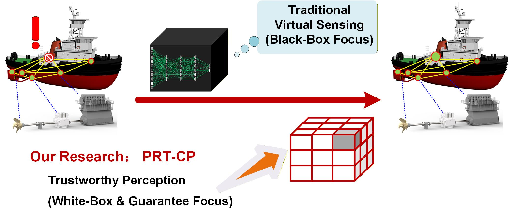

# Trustworthy Virtual Sensing via Physics-Residual Transformers and Conformal Prediction

**Journal:** Knowledge-Based Systems | **Status:** Under Review 2026

## Graphical Abstract



## Overview

This paper proposes the PRT-CP framework for trustworthy virtual sensing in 
safety-critical industrial systems. The framework integrates:

- **Physics-Residual Transformer** — anchors predictions within physical constraints
- **Conformal Prediction** — provides distribution-free coverage guarantee  
- **CTI** — holistic trustworthiness evaluation metric

## Code

| File | Description |
|------|-------------|
| `Phys-Transformer-PC2UQ_LPG_with_CTI.ipynb` | Main experiment notebook (LPG case) |

## Citation
```
@article{wang2026prtcp,
  title={Trustworthy Virtual Sensing via Physics-Residual Transformers and Conformal Prediction},
  author={Wang, Bin and Zio, Enrico},
  journal={XXX},
  year={2026}
}
```
